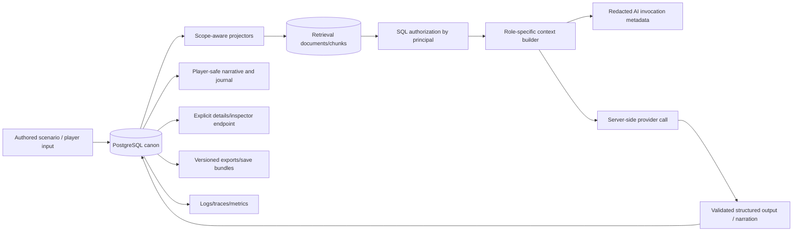

# Privacy data flow

## Rules at each edge

1. Canon data is separated into truth, observations, beliefs, memories, thoughts, and narration tables/projections.
2. Projectors assign explicit scopes and owner IDs; mixed-scope chunks are rejected.
3. Authorization filters execute before lexical, graph, or vector scoring.
4. Context builders receive a complete principal and emit section metadata/document IDs for audit, not private text by default.
5. Provider calls occur server-side with credentials only in process memory; raw prompts/responses are not retained by default.
6. Validated model proposals may become canon only through domain/persistence checks. Narration cannot mutate canon.
7. The player UI receives only player-known data. NPC fictional thoughts are fetched only through explicit response-details requests and are never fed back to other prompts.
8. Exports exclude credentials, cookies, queue state, and raw private prompt bodies. Deletion/archive procedures deactivate retrieval sources and preserve required audit lineage.
